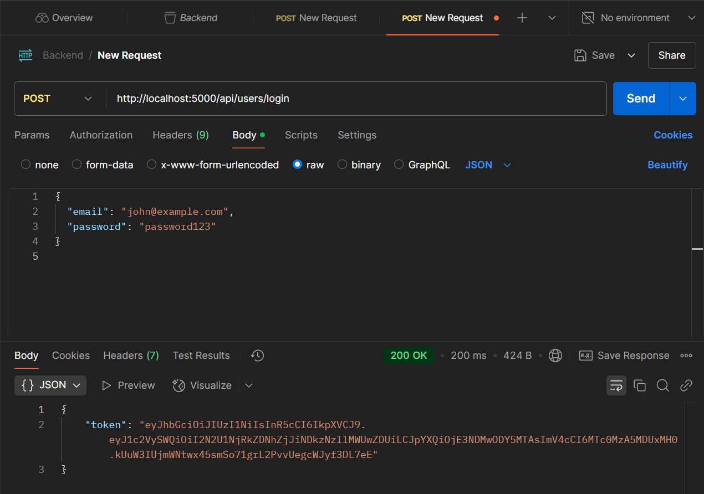
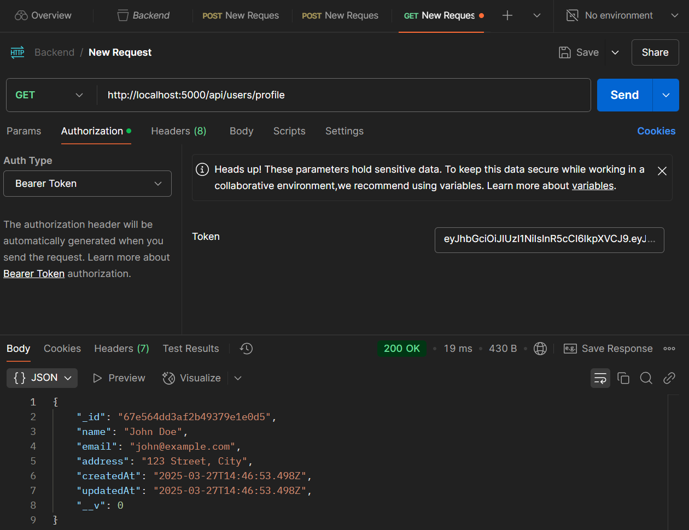
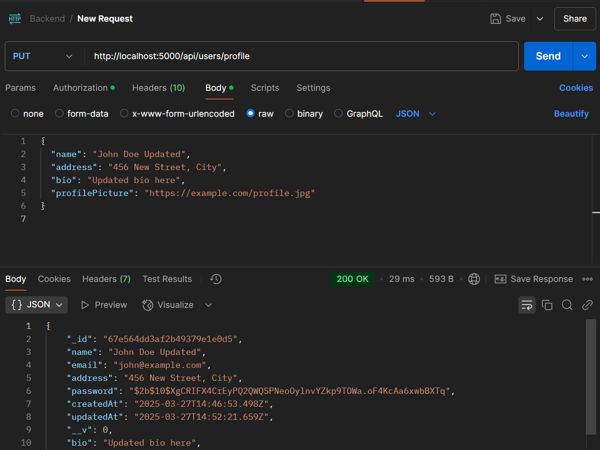

## **📌 User Profile Management API**  
A RESTful API for managing user profiles with authentication.  

### **🚀 Installation & Setup**  

### **1️⃣ Clone the Repository**  
```sh
git clone https://github.com/SeeminKhan/Backend.git

cd backend
```

### **2️⃣ Install Dependencies**  
```sh
npm install
```

### **3️⃣ Configure Environment Variables**  
Create a `.env` file in the root directory and add:  

```env
PORT=5000
MONGO_URI=your_mongodb_connection_string
JWT_SECRET=your_jwt_secret_key
```

### **4️⃣ Start the Server**  
```sh
npm start
```
The API will run on **`http://localhost:5000`**  

---

## **📁 API Endpoints**  

### **🔹 Authentication**  
- `POST /api/users/register` → Register a new user  
- `POST /api/users/login` → User login (returns JWT token)  

### **🔹 User Profile (Protected)**  
- `GET /api/users/profile` → Get logged-in user's profile  
- `PUT /api/users/profile` → Update logged-in user's profile  
--

## **📖 Postman Documentation**  
For easy API testing, use the Postman collection:  

**import the collection** manually:  
- Download `Backend.postman_collection.json`  
- Import into Postman

## Here are some sample API responses tested in Postman:

### 🔹 Register User API


### 🔹 Login API


### 🔹 Get User Profile API


### 🔹 Update User Profile API


---
